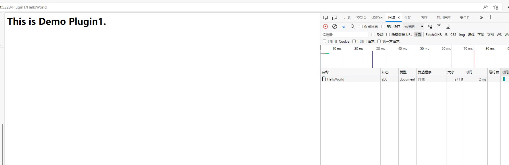

# DH.FrameWork

#### 介绍
基于net core的底层开发框架，目前主要net core 版本号为：7.0.100-rc.2.22477.23，支持插件模式。

已上传Nuet:请搜索DH.Web.Framework

交流请加群：774046050

1、单例方法可以使用`Singleton<T>.Instance`  
2、支持多语种  
3、支持插件  
4、数据库ORM使用新生命的NewLife.XCode  
5、支持缓存  
6、支持项目内事件发布和消息  
7、支持动态路由，目前暂支持首页动态路由为指定插件的页面路由。
8、支持钉钉和企业微信WebHook
9、支持基于Json持久化存储的内存数据库

插件页面性能

